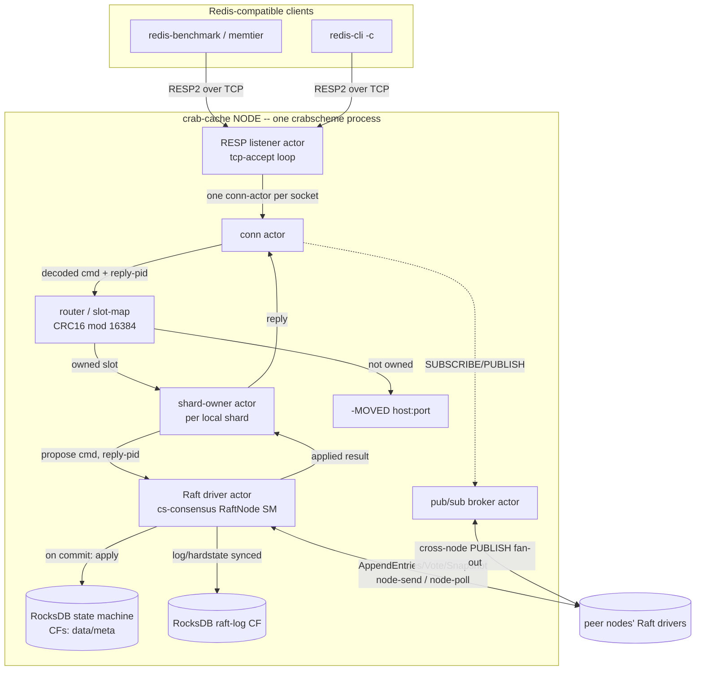

# crab-cache — Design

> Architecture for a sharded, RocksDB-durable, Raft-replicated, RESP-compatible
> distributed cache **built in CrabScheme**. Read `requirements.md` first.

This document specifies *how* we satisfy the requirements with the actual
primitives the scouting pass confirmed exist (actor builtins, `cs-consensus`
Raft, the `cs-ffi` host-procedure pattern, `cs-net`/`cs-distrib` transport, and
the `node-send`/`node-poll` distrib builtins).

---

## 1. System architecture



**One sentence:** a client speaks RESP to a node; a connection-actor decodes the
command, the router maps its key to a slot→shard, the shard-owner actor proposes
the mutation to that shard's Raft group (a `cs-consensus` `RaftNode` driven by an
actor), Raft commits it across replicas (each persisting log+data to RocksDB),
and on commit the driver replies to the shard-owner which answers the client —
**all orchestration in Scheme, storage + consensus core in Rust behind FFI.**

---

## 2. Component inventory

### New Rust crates / modules
> Per the **§0 language mandate** (requirements.md), these are **substrate only** —
> a RocksDB binding, the consensus core/extension, and runtime primitives. **None
> of them contain cache behavior** (commands, protocol semantics, routing, expiry,
> pub/sub). All of that is the Scheme libraries below.

| Crate | Purpose | Pattern it follows |
|-------|---------|--------------------|
| **`cs-store`** | RocksDB host-procedure module: `store-*` builtins (open/get/put/delete/iterate/write-batch/checkpoint), opaque fixnum handles. | `cs-stdlib-tls` / `cs-stdlib-sql` (native-only host-proc crate). |
| **`cs-consensus` (extend)** | Add (a) a pluggable **RocksDB-backed log + HardState store** behind the `RaftNode` (today `Vec<Entry>`), (b) an **index→reply** commit-notification path surfaced to the driver. | extends the just-landed crate (PR #114). |
| **`cs-resp`** *(deviation — NOT default)* | A Rust **byte-tokenizer** accelerator, built **only** if Phase-4 numbers prove the Scheme codec's tokenizer is the bottleneck **and** it is explicitly approved (§0). Touches byte-splitting only — **never** command semantics. | off unless approved. |
| **client-TCP builtins** (verify/extend `cs-stdlib-net`) | `tcp-listen` / `tcp-accept` / `tcp-read` / `tcp-write` / `tcp-close` for *client* sockets (distinct from cs-net inter-node channels). | C4 risk — verify first. |

### New Scheme libraries (`src/*.scm` in **this** repo) — the showcase
| Module | Responsibility |
|--------|----------------|
| `resp.scm` | RESP2 parse/serialize over bytevectors (using the stdlib `binary` module). |
| `commands/*.scm` | Per-type command semantics: `string.scm`, `hash.scm`, `list.scm`, `set.scm`, `zset.scm`, `keys.scm`, `pubsub.scm`, `cluster.scm`. |
| `slotmap.scm` | CRC16 keyslot, `{hashtag}`, slot→shard→node map, `MOVED`/`ASK`. |
| `encoding.scm` | Logical value ⇄ RocksDB key/value byte schema (per §7). |
| `node.scm` | Node bootstrap: read config, open RocksDB, start listener/router/shard-owner/Raft-driver/pubsub actors, supervise. |
| `shard.scm` | Shard-owner actor body + Raft-driver glue (propose, await commit reply). |
| `bench/driver.scm` | (Stretch ST5) native Scheme load generator. |

### Reused, already on `main` (or via #114)
- Actor builtins: `spawn-activation`, `spawn-source`, `send`, `raw-receive`,
  `receive`, `call`, `self`, `monitor`, supervisors, `define-behavior`
  (`cs-runtime/src/builtins/beam.rs`, `lib/beam/prelude.scm`).
- `cs-consensus`: `RaftNode<SM>`, `StateMachine`, `RaftDriver`, `spawn_raft_actor`,
  `RaftCommand::Propose`, Sim `Cluster` (PR #114).
- Cross-node transport: `node-send`/`node-poll`/`node-listen`/`node-connect`
  (+`-tls`/`-quic`) distrib builtins (`cs-runtime/src/builtins/distrib.rs`),
  `cs-net` TCP/mTLS/QUIC, `cs-distrib` Router/DistPid/DOWN.

---

## 3. Node anatomy (actors per process)

Each node is a single `crabscheme` process running `node.scm`. It spawns and
supervises this actor tree (`spawn-activation` unless noted — parks on empty
mailbox, so thousands of connection-actors are fine):

```
root-supervisor (one-for-one)
├── resp-listener            (owns the TCP accept loop; spawns conn-actors)
│   └── conn-actor × N       (one per client socket; RESP read→dispatch→write)
├── router                   (pure: slot→shard→owner-pid resolution; can be a lib, not an actor)
├── shard-owner × S          (one per shard this node hosts; serializes that shard's commands)
│   └── raft-driver × S      (cs-consensus RaftNode for the shard; via spawn_raft_actor)
├── pubsub-broker            (channel→subscriber-pids; cross-node fan-out)
├── active-expiry            (advances logical-clock expiry ticks through Raft)
└── peer-poller              (drives node-poll to drain inbound Raft/cluster traffic)
```

**Why a `shard-owner` distinct from the `raft-driver`:** the shard-owner holds
the *Redis-semantic* command logic (e.g. `INCR` = read-modify-write, `LPUSH` =
prepend) and turns it into a deterministic Raft command; the raft-driver only
does consensus. Keeping them separate keeps the SM apply function a pure,
deterministic byte-transform (required for replica convergence), with all the
"interesting" Scheme on the owner side.

---

## 4. Sharding & routing

- **Slots:** Redis-identical **16384** slots; `slot = CRC16(key) mod 16384`.
  `{hashtag}` substring hashing supported (so `{user1}:a` and `{user1}:b` co-locate).
  This is what lets `redis-cli -c` and cluster-aware clients work unmodified.
- **Shards:** slots partitioned into **S** shards (config-defined ranges). Each
  shard = one Raft group with **R** replicas across distinct nodes.
- **Slot map:** `slotmap.scm` holds `slot → shard-id`, `shard-id → (leader-node,
  replica-nodes)`. Static in v1 (from config); a copy lives on every node and is
  itself a (small) Raft-replicated config shard so it stays consistent (stretch:
  live rebalancing via `propose_conf`).
- **Routing decision** (in the conn-actor, before touching storage):
  1. Compute slot. If this node hosts the shard's **leader** → dispatch to local
     `shard-owner`.
  2. If hosts a **follower** and connection is `READONLY` → local ReadIndex/local
     read (stretch ST2); else `-MOVED slot leader-host:port`.
  3. If not hosted → `-MOVED slot owner-host:port`.
  4. Multi-key command spanning >1 slot → `-CROSSSLOT`.
- **`CLUSTER SLOTS`/`NODES`/`KEYSLOT`** rendered from `slotmap.scm`.

---

## 5. Consistency — the write/read paths and the commit→ack bridge

### Write path (linearizable)
```
conn-actor: parse "SET k v"
  → slot=CRC16(k); owner = local shard-owner pid
  → (call shard-owner (list 'cmd 'SET k v reply-to=self) timeout)
shard-owner: validate; build deterministic command bytes  C = encode-op(SET,k,v)
  → (send raft-driver (list 'propose C reply-to=conn-actor req-id))
raft-driver (Rust RaftNode via actor): node.propose(C) → (Some idx, outs)
  → route outs to peers via node-send; record  idx → (reply-to, req-id)
  → on subsequent ticks/messages, when commit_index advances past idx and
     StateMachine::apply(C) returns result bytes R:
       (send reply-to (list 'applied req-id R))
conn-actor: receives ('applied req-id R) → serialize RESP reply → tcp-write
```

### The commit→ack bridge (cs-consensus extension — Constraint C2)
Today `StateMachine::apply` is the only hook and there is **no notification**.
We add, in the **driver** (not the pure core, keeping the core deterministic):

- `RaftDriver` keeps `pending: HashMap<Index, (ActorPid, ReqId)>`.
- On `propose(C)` returning `Some(idx)`, insert `idx → (reply_pid, req_id)`.
- After each `apply` that advances `last_applied`, for every newly-applied index
  in `pending`, **send an actor message** `('applied req-id result-bytes)` to the
  recorded pid, then drop the entry.
- **No Rust future is exposed to Scheme** (satisfies FR-4.4) — the bridge is pure
  actor messaging, which is the whole point of the showcase.
- Leadership loss before commit: entries that get overwritten notify
  `('redirect leader)` or `('retry)`; the conn-actor emits `-MOVED`/retries.

### Read path
- **Default linearizable:** `ZSCORE`/`GET` etc. issue `node.read(req_id, query)`
  (ReadIndex); the driver drains `take_ready_reads()` and replies via the same
  actor-message bridge. `ReadResult::NotLeader` → `-MOVED`.
- **Fast local (opt-in, ST2):** a `READONLY` connection reads the RocksDB CF
  directly on a follower (no Raft round-trip) — measured as a separate bench line;
  off by default so default numbers are honestly linearizable.

---

## 6. Durability — RocksDB layout + the Raft WAL extension

**Full durability (FR-5):** an acknowledged write survives `kill -9` + restart.
RocksDB itself provides fsync via its WAL when we write with `sync=true`; we lean
on that rather than hand-rolling fsync.

### RocksDB column families (per node, one DB per node)
| CF | Key | Value | Notes |
|----|-----|-------|-------|
| `data:<shard>` | encoded user key (per §7) | encoded value | the state machine store |
| `meta:<shard>` | `applied_index`, `snapshot_index`, config | bytes | SM bookkeeping |
| `rlog:<shard>` | `index:u64` (big-endian) | encoded `Entry` | **Raft log** (the WAL) |
| `rhard:<shard>` | `"hardstate"` | `(term, vote, commit)` | persisted before vote/append ack |
| `rsnap:<shard>` | `snapshot_index` | snapshot bytes | latest compacted snapshot |

### cs-consensus log-store extension (the main net-new Rust work)
- Introduce a `RaftLogStore` trait in `cs-consensus`:
  `append(entries)`, `entries(lo,hi)`, `truncate_suffix(from)`, `term(idx)`,
  `last()`, `save_hardstate(hs)`, `load_hardstate()`, `save_snapshot/load_snapshot`.
- Provide two impls: the existing in-memory `Vec<Entry>` (keep for Sim/tests),
  and **`RocksLogStore`** backed by `cs-store` (the CFs above), writing with
  `WriteOptions::set_sync(true)`.
- **Ordering invariant (FR-5.2):** persist log entries / hardstate **before** the
  `RaftNode` emits the `AppendEntries`-ack or returns success from `propose`. The
  driver enforces "persist, then send".
- **Recovery:** on start, `node.restore_from(store)` reloads hardstate + snapshot
  + log tail, sets `commit/applied`, and replays applied entries into the RocksDB
  SM (idempotent — SM also persisted, so replay resumes from `meta.applied_index`).
- **Snapshots:** `compact()` writes `sm.snapshot()` to `rsnap` and trims `rlog`;
  for large shards, prefer a **RocksDB checkpoint** of `data:<shard>` as the
  snapshot artifact instead of a serialized blob (cheap, hard-linked).

> Note: the SM itself is RocksDB-backed, so `apply` mutates `data:<shard>`
> durably. The "Raft WAL" is the `rlog`/`rhard` CFs. Both share the node's RocksDB
> instance (one WAL underneath), so a single fsync covers a batched apply+logentry
> via a `WriteBatch` — this is how we keep write amplification sane.

---

## 7. Data-type encodings in RocksDB

All within a shard's `data:` CF. Type tag is the first key byte; this gives O(1)
`TYPE`, clean `DEL`, and prefix scans for composite types.

| Type | Key schema | Value | Ops enabled |
|------|-----------|-------|-------------|
| string | `S:` + key | `[ttl_logical:u64][bytes]` | GET/SET/INCR/APPEND |
| hash | `H:` + key + `\0` + field | `[bytes]`; meta `H#:`+key→`[len][ttl]` | HSET/HGET/HSCAN |
| list | `L:` + key + `:` + seq(i64, signed-order-preserving) | `[bytes]`; meta `L#:`+key→`[head_seq][tail_seq][len][ttl]` | LPUSH/RPUSH/LRANGE via seq window |
| set | `E:` + key + `\0` + member | `1`; meta `E#:`+key→`[card][ttl]` | SADD/SISMEMBER/SSCAN |
| zset | by-member `Z:`+key+`\0`+member→`score:f64`; by-score `Zs:`+key+`\0`+`score(orderable f64)`+`\0`+member→`1`; meta `Z#:` | dual-index | ZADD/ZRANGE/ZRANGEBYSCORE |

- **TTL** is stored as a **logical-clock deadline** (a Raft-log tick counter),
  not wall-clock — so every replica expires a key at the same applied index
  (FR-6.2). Wall-clock is mapped to logical ticks by the active-expiry actor
  proposing periodic `TICK` commands; reads compare the key's deadline to the
  current applied logical clock.
- Orderable float encoding for zset scores: standard IEEE-754 → sortable-bytes
  transform (flip sign bit / invert negatives) so RocksDB's byte order = numeric
  order for `ZRANGEBYSCORE`.
- Signed-order-preserving seq for lists: bias i64 by 2^63 so big-endian bytes
  sort correctly for negative head indices (LPUSH grows downward).

---

## 8. `cs-store` — the RocksDB FFI layer

Follows the confirmed `cs-stdlib-tls`/`cs-stdlib-sql` pattern exactly.

- **Crate:** `crates/cs-store`, `rocksdb = { workspace = true }`; feature-gated
  `stdlib-store` in `cs-runtime`; **excluded from `wasm-stdlib`** (RocksDB can't
  target wasm). Wiring = the ~8 mechanical sites the scout enumerated (root
  `Cargo.toml` member + `[workspace.dependencies]`; `cs-runtime/Cargo.toml`
  optional dep + feature; `register_stdlib()` block near `lib.rs:2040`; `stdlib`
  umbrella; `cs-cli` feature).
- **Handles:** `static OnceLock<Mutex<Registry>>` mapping `i64 → DbHandle` /
  `i64 → Iterator` / `i64 → WriteBatch` (fixnum-slab, identical to TLS streams).
- **Procedures** (`procs() -> Vec<Arc<dyn HostProcedure>>` via `UntypedProc::new`):
  `store-open path opts → handle`, `store-close`, `store-cf-create`,
  `store-get handle cf key → bytes|#f`, `store-put handle cf key val [sync?]`,
  `store-delete`, `store-multi-get`, `store-write-batch handle ops [sync?]`
  (atomic apply+logentry), `store-iter handle cf prefix → iter`,
  `store-iter-next iter → (k . v)|#f`, `store-checkpoint handle dir`,
  `store-flush`, `store-approx-size`.
- **Marshaling:** keys/values as **bytevectors** (`cs_ffi::marshal` bytevector
  path); booleans/ints via `IntoValue`. Panic-safe: `UntypedProc::call` already
  wraps in `catch_unwind` → `FfiError::Panic`, so a RocksDB panic can't abort the
  runtime.
- **Atomicity:** `store-write-batch` exposes RocksDB `WriteBatch` so a single
  Raft apply (data mutation + `meta.applied_index` bump + optionally the log
  entry) is one atomic, optionally-synced write.

---

## 9. RESP layer

- **RESP2** over TCP. Parser handles inline + array/bulk frames; serializer emits
  the five reply types; pipelining = read all available, dispatch in order, buffer
  replies, flush.
- **Placement (§0 mandate):** the RESP codec is **CrabScheme** (`resp.scm` over
  the stdlib `binary`/bytevector primitives) — it is protocol logic, hence part
  of the cache, hence Scheme. A Rust accelerator is **not** a default; only if
  Phase-4 `redis-benchmark` proves the *byte tokenizer* (never the command
  semantics) is the dominant cost, accelerating that tokenizer alone is a
  **documented deviation requiring explicit approval**, published with its
  measurement.
- **Client sockets (Constraint C4):** the listener needs raw `tcp-listen`/
  `tcp-accept`. Phase 4 first **verifies** `cs-stdlib-net` provides this; if not,
  add a minimal accept shim (native builtin) — small, well-scoped.
- **Connection actor:** one `spawn-activation` actor per accepted socket; its
  mailbox parks between client requests (so 10k idle connections cost ~nothing).

---

## 10. Actor topology & the `!Send` reality (Constraint C3)

- Scheme `Value` is `Rc`-based (`!Send`) → **no closures cross threads/nodes.**
  All actors are `spawn-activation`/`spawn-source` (source-text + sendable args).
- **Intra-node** messaging is ordinary `(send pid msg)` / `(call pid msg)`.
- **Inter-node** (Raft AppendEntries/Vote/Snapshot, cross-node PUBLISH) uses the
  proven **`node-send from to bytes`** / **`node-poll node`** distrib builtins —
  *not* transparent `(send remote-pid …)` (that ActorRef→RemoteRef bridge is
  unwired on `main`). The `peer-poller` actor loops `node-poll` to drain inbound
  frames and routes them to the right raft-driver by shard id.
- Nodes are **not** spawned remotely (`spawn-remote` is blocked); each node is
  started independently from config and they *discover/connect* via
  `node-connect`/`node-listen`. This sidesteps the M12 closure-shipping wall
  entirely.

---

## 11. Cluster bootstrap & membership

- **Config** (`node-N.toml`): this node's id/addr, the full node list + addrs,
  replication factor R, slot→shard ranges, transport (tcp|mtls|quic), RocksDB path.
- **Start:** `crabscheme run lib/crab-cache/node.scm -- --config node-N.toml`.
  `node.scm` opens RocksDB, recovers any persisted Raft state, `node-listen`s,
  `node-connect`s to peers, starts the actor tree, and for each shard it replicates
  constructs a `RaftNode::new(id, voters, cfg, RocksSM(shard))` driven by
  `spawn_raft_actor`.
- **Failover:** Raft handles leader election; clients following `-MOVED`/retrying
  (standard Redis cluster client behavior) re-route to the new leader. The slot
  map's leader hint is refreshed from Raft `leader()` and surfaced via
  `CLUSTER SLOTS`.
- **Membership (stretch ST1):** `propose_conf(new_voters)` (joint consensus is
  already implemented in `cs-consensus`) + slot reassignment with `-ASK`
  during migration.

---

## 12. Pub/Sub

- A `pubsub-broker` actor per node holds `channel → set<subscriber conn-pid>` and
  `pattern → set<conn-pid>`.
- `SUBSCRIBE`/`PSUBSCRIBE` register the conn-actor's pid; `UNSUBSCRIBE` removes it;
  on conn-actor death (monitored) it's purged.
- **`PUBLISH ch msg`** is **cluster-wide**: the local broker delivers to local
  subscribers and `node-send`s the publish to every other node's broker, which
  delivers to *their* local subscribers. (Pub/sub is *not* slot-routed in Redis;
  it's global — we match that.) Delivery is best-effort (Redis semantics), so it
  does **not** go through Raft.
- This is a natural actor-fan-out showcase: no shared state, pure message passing.

---

## 13. Failure handling

| Failure | Behavior |
|---------|----------|
| Leader crash | Raft re-elects; in-flight proposes time out → conn-actor retries / `-MOVED`. No acked write lost (committed = durable on quorum). |
| Follower crash | Leader continues (quorum intact); follower catches up via log/snapshot (InstallSnapshot) on restart. |
| Node restart | Recover hardstate+log+snapshot from RocksDB; replay to applied; rejoin groups. |
| Net partition (minority) | Minority can't commit (Raft safety); serves stale reads only if `READONLY`. |
| conn-actor death | Monitored by listener + pubsub-broker; resources reclaimed. |
| RocksDB error/panic | `FfiError::Panic` surfaced; shard-owner fails the op (`-ERR`), supervisor policy decides restart. |

---

## 14. Observability

- `INFO` sections: `server` (version/uptime), `clients`, `cluster` (myid, shards,
  slots), `replication` (per-shard role/term/commit/applied/lag), `persistence`
  (RocksDB live-SST bytes, WAL size), `stats` (ops/sec counters, keyspace hits/misses).
- `--metrics` emits a line-protocol sample each second for the bench harness to
  scrape (throughput/latency/role-changes), so failover dips are quantified.
- Structured `tracing` logs per node (already a dep of cs-consensus).

---

## 15. Benchmark architecture (the proof)

A **networked** cache cannot be timed by the existing `bench/aot-vs-runtimes.sh`
hyperfine harness (that times whole-process runs). We add `bench/crab-cache/`:

- **`run.sh`** orchestrates: build release `crabscheme`; `brew`-check
  redis/memtier; start crab-cache cluster (S shards × R replicas) and a matched
  Redis (single + cluster); run loads; collect JSON; render markdown.
- **Load generators:** `redis-benchmark` (default command suite, multiple `-P`
  pipeline depths and `-c` client counts) and `memtier_benchmark` (mixed
  read/write ratios, key/value size distributions).
- **Scenarios:**
  1. *Single-node head-to-head*: crab-cache 1-node vs Redis 1-node, **matched
     durability** (Redis `appendfsync always` ↔ our synced Raft+RocksDB; also an
     `everysec` ↔ relaxed regime). Per-command throughput + p50/p99/p999.
  2. *Sharding scale*: crab-cache 1→3→6 shards on independent keys; throughput
     curve; vs Redis Cluster at equal node count.
  3. *Failover under load*: sustained `memtier`; kill a leader mid-run; record
     throughput dip + recovery time; assert **zero acked-write loss**.
  4. *Crash-recovery*: 50k acked writes, `kill -9`, restart, verify all present.
- **Correctness harness:** record an op/response history under concurrency +
  induced failover; check **linearizability** offline (Porcupine/Knossos-style
  model for a register/per-key) — a *passing* check under failover is the
  headline correctness result.
- **Fairness (NFR-13/14/15):** same host/cores, ≥3 repeats with variance, warm
  caches, identical value sizes / key cardinality / pipeline depth per row,
  durability explicitly matched and **both regimes published**.
- **Outputs:** `docs/measurements/<date>-crab-cache-vs-redis.md` (mirrors the
  existing measurements-doc format) + `docs/milestones/crab-cache-exit.md` with
  the LOC-Scheme-vs-Rust effectiveness argument and the honest perf verdict.

---

## 16. cs-consensus extensions required (summary of net-new Rust)

1. `RaftLogStore` trait + `RocksLogStore` impl (RocksDB-backed log/hardstate/
   snapshot) with synced-before-ack ordering. *(largest item)*
2. `RaftDriver` commit-notification: `pending: Index → (ActorPid, ReqId)` →
   `('applied req-id result)` actor message on apply; redirect/retry on overwrite.
3. `node.restore_from(store)` recovery entry point.
4. (Stretch) checkpoint-based snapshots for large shards.

Everything else Raft needs (election/replication/ReadIndex/joint-membership/
InstallSnapshot) already exists in the landed crate.

---

## 17. Key design decisions & open items

- **DD-1 Two Raft impls exist** — the Rust `cs-consensus` `RaftNode<SM>` (PR #114)
  and a pure-Scheme `raft.scm` (already on `main`). We use the **Rust** one:
  RocksDB-backed durability and the SM byte-apply contract live naturally at the
  Rust↔C++ FFI boundary, and it's faster than interpreting Raft in Scheme. The
  Scheme cache logic drives it via the actor bridge. *(The pure-Scheme engine
  remains available for an even-more-in-language variant if we ever want it.)*
- **DD-2 RESP codec placement** — **Scheme** (the codec is cache/protocol logic →
  §0 mandate). Any Rust tokenizer accelerator is an approval-gated deviation, not
  a default (§9).
- **DD-3 Logical-clock TTL** — chosen over wall-clock for replica determinism (§7).
- **OQ-1 client TCP accept** — verify `cs-stdlib-net` exposes `tcp-listen`/
  `tcp-accept`; if not, add a shim (Phase 4, first task).
- **OQ-2 single-DB vs per-shard-DB** — start with **one RocksDB per node** (CFs
  per shard) for a shared WAL/fewer fds; revisit if shard isolation needs it.
- **OQ-3 RESP3** — deferred (ST3); RESP2 is sufficient for all bench tools.
